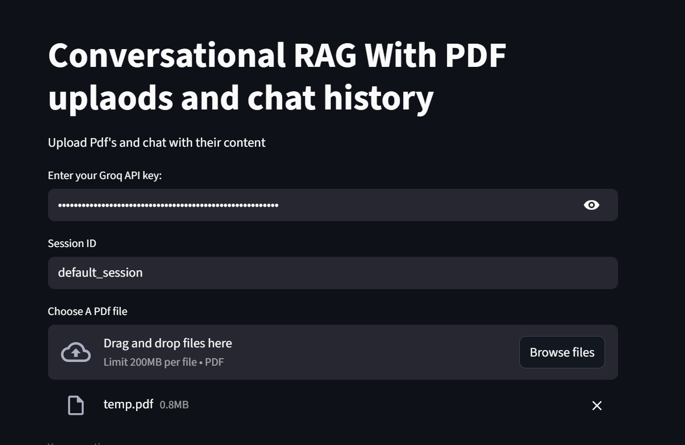
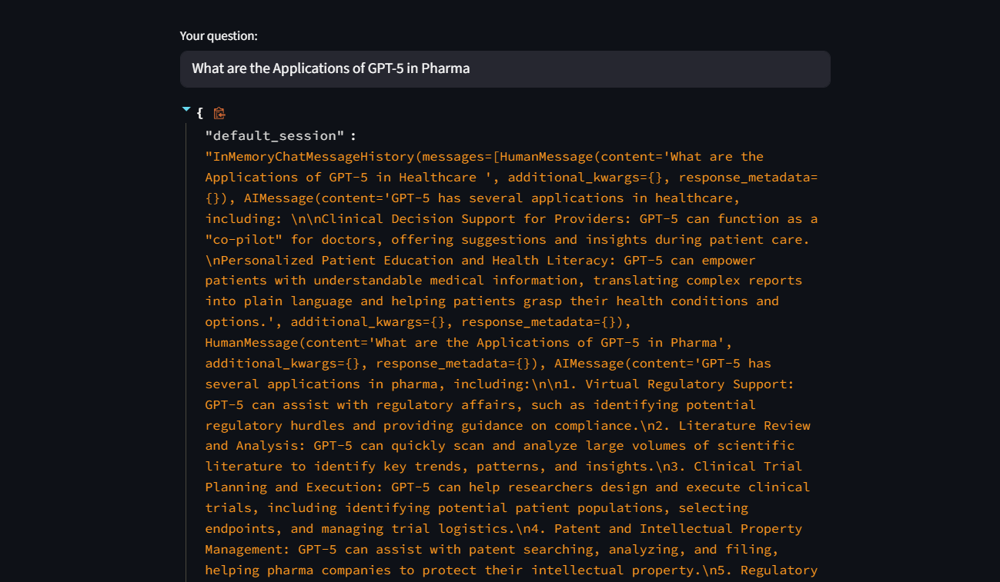
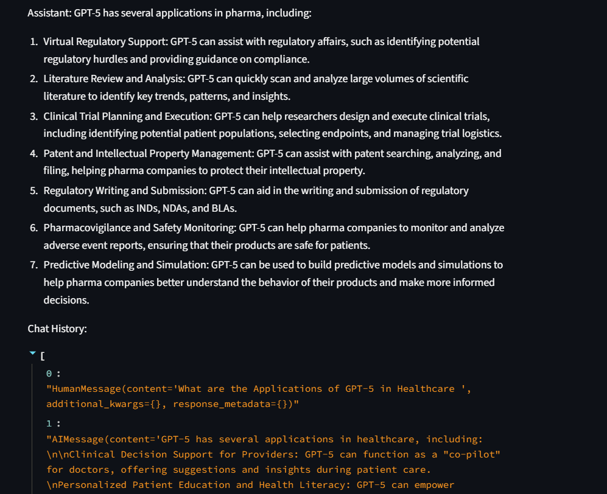

# Conversational RAG with PDF Uploads & Chat History (Groq + LangChain)

 A lightweight Streamlit app for chatting with your PDFs using a conversational RAG pipeline.
 It supports multi-PDF upload, session-scoped chat history, HuggingFace embeddings + Chroma vector store, and Groq LLMs for fast answers.

✨ Features

Upload one or more PDFs and build a temporary vector index on the fly.

Conversational RAG: queries are rewritten with chat history before retrieval for better grounding.
Fast inference with Groq (e.g., llama-3.1-8b-instant).
Local embeddings via sentence-transformers/all-MiniLM-L6-v2.
Simple, clean Streamlit UI with session IDs so you can run multiple chats.

🖼️ Screenshots

### Landing / Key Entry & Upload

### Answer + Raw Trace (debug view)

### Clean Answer + History

In the sample screenshots, a PDF is uploaded and the app answers: “What are the Applications of GPT-5 in Pharma?”

🧱 Architecture

Load PDFs with PyPDFLoader.

Split into chunks (default: 5k chars, 500 overlap).

Embed chunks with HuggingFaceEmbeddings.

Store vectors in Chroma (in-memory for this demo).

History-aware retriever rewrites the user query using chat history.

RAG answer chain (“stuff” combine) feeds retrieved context to the Groq LLM for a concise answer.

🚀 Quickstart
1) Prerequisites

Python 3.9+

A Groq API key → https://console.groq.com

(Optional) A Hugging Face token if needed for private models

2) Clone & install
git clone <your-repo-url>
cd <your-repo>
pip install -r requirements.txt

requirements.txt (suggested)

3) Environment

Create a .env in the project root:

GROQ_API_KEY=your_groq_api_key
HF_TOKEN=your_hf_token_optional

4) Run
streamlit run app.py

5) Use

Paste your Groq API key in the UI.

Set a Session ID (or keep default_session).

Upload one or more PDFs.

Ask questions conversationally—answers are grounded in your uploaded docs.

⚙️ Configuration Tips

Model: change Groq model in ChatGroq(..., model_name="llama-3.1-8b-instant").

Chunks: tweak chunk_size / chunk_overlap for your documents.

Persistence: to persist the index across runs, switch to:

vectorstore = Chroma.from_documents(
    documents=splits,
    embedding=embeddings,
    persist_directory=".chroma"
)
vectorstore.persist()

Multiple PDFs: They’re indexed together to enable cross-document answers.

🧪 Example Workflow

Upload a long technical PDF.

Ask high-level questions (“Summarize the key findings”).

Drill down with follow-ups (“What methods were used?”, “List limitations”).

The retriever reformulates queries with chat history so each answer stays grounded.

🔐 Privacy & Security

Indices are built in memory by default for this demo.

Your Groq key is entered client-side via Streamlit; do not commit it to Git.

For production, consider: persistent vector stores, secrets management, audit logs, and document-level access control.

🧰 Tech Stack

Frontend/App: Streamlit

RAG: LangChain (history-aware retriever + “stuff” combine chain)

Embeddings: HuggingFace (all-MiniLM-L6-v2)

Vector DB: Chroma

LLM: Groq (Llama 3 family)

🐛 Known Limitations / TODO

The demo index is ephemeral (cleared on app restart). Add persist_directory to keep vectors.

The uploader writes to a temp file name (temp.pdf). For heavy parallel usage, give each file a unique temp path.

Add per-chunk citations (page/section pointers) to answers.

Dockerize; add auth; support other file types (DOCX, HTML).

Optional: replace “three sentences max” system rule with a configurable control in the UI.

🤝 Acknowledgements

LangChain & community integrations

ChromaDB

HuggingFace Transformers & Sentence-Transformers

Groq (ultra-low-latency inference)
